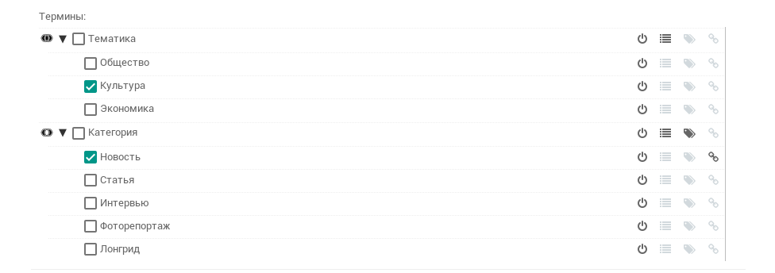

.. Django EDW documentation master file, created by
   sphinx-quickstart on Tue Feb 12 15:09:42 2019.
   You can adapt this file completely to your liking, but it should at least
   contain the root `toctree` directive.

Документация Django EDW
=======================

Что это такое
=============

Django EDW -- это пакет для Django, который систематизирует объекты в системе:

- Делает сложные семантические выборки
- Сортирует и группирует экземпляры разных моделей по общим признакам
- Генерирует REST API

Написать про подключение?

Как это работает
================

Главная часть EDW -- это дерево терминов. **Термин** -- это дополнительное свойство, которое может быть у объекта. Например, для книги можно создать термины "Вид" -- "Электронная" или "Бумажная" и "Жанр" -- "Детектив", "Фантастика" и так далее. 

**Дерево терминов** -- это структура, которую образуют свойства всех объектов в системе:

.. image:: images/create-term-tree.png

На этой картинке "Объект" и всё что в него вложено -- это термины, которые система сгенерировала сама, изучив модели. "Тематика", "Категория" и всё что в них вложено -- это термины, которые добавил и настроил администратор сайта.
    
У каждой модели, подключенной к EDW, есть поле "Термины". Представим, что администратор новостного сайта добавляет новость о том, что в центре города открылся музей. Администратор указывает термины "Новость" и "Культура":

Порядок установки терминов определяется семантическим правилом их родителя. У терминов "Статья" и "Новость" есть родитель "Категория", у которого задано семантическое правило "Исключающее или". Это значит, что свойство "Категория" в одном объекте может иметь только одно значение из дочерних терминов: либо "Статья", либо "Новость". Для того, чтобы можно было выбрать несколько значений, правило нужно изменить. Например, на "Или".

Если у объекта выбрать родительский термин "Категория", это будет означать, что объект относится ко всем дочерним категориям одновременно.

Термины нужны для того, чтобы формировать по ним витрины данных.

**Витрина данных** -- это, по сути, набор правил для отбора объектов. Термины витрины сравниваются с терминами объектов, и получается выборка с определенными свойствами, например, только фоторепортажи на тему культуры. Ещё прямо в витрине можно выбрать порядок сортировки, внешний вид представления, добавить зависимости. 

В EDW уже есть теги для основных операций вроде получения витрины по id или символьному slug'у, и некоторые фильтры для валидации данных. 

REST API
---------------

API туть: /edw/api/. 
